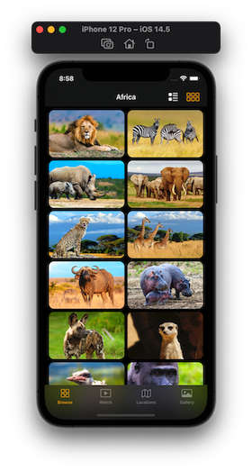
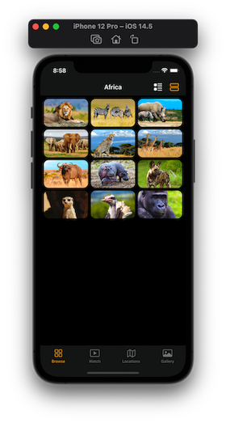
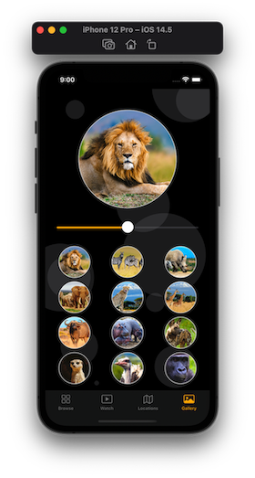
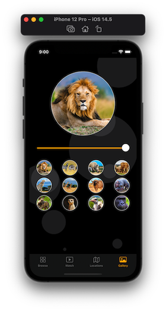

# Africa

Take a trip to Africa and learn a little bit about some of the magnificent animals!

## Features

Four main screens that allow you to browser, watch, locate and view images of Africa's animals.

List and grid layout designs.

Interactive map that lets you move around the world.

Gallery to view animals with a slider to control image grid layout.

View toggles to control how you browse animals.

## Requirements

To run the simulator, you will need Xcode, I use v12.5

## Demo

  

  

  

 

## Footnote

This app is apart of a course purchased on Udemy which you can find here [SwiftUI Masterclass](https://www.udemy.com/course/swiftui-masterclass-course-ios-development-with-swift/)
